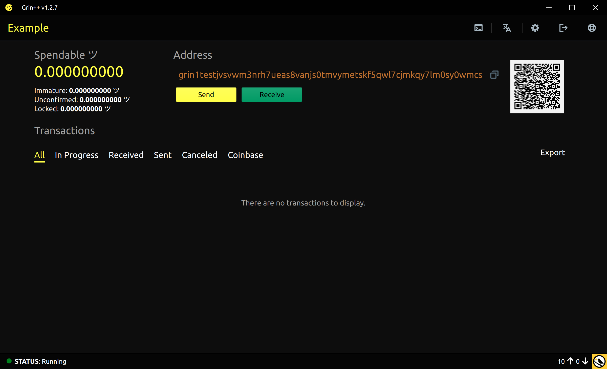

A commnand-line vanity address generator for Grin. I made this mostly for fun and to familiarize myself with the various Grin libraries written in Rust. The code is currently a lot slower than expected since deriving a slatepack address from a seed seems to be ~1000x slower that deriving it from a raw public key.

# Installation

```bash
cargo install grin-vanity
```

# Example usage
The output below depicts an adrress found with the pattern `grin1test` and its corresponding seed.

```bash
$ grin-vanity --threads 30 --pattern grin1test --interval 180
Searching for pattern grin1test
Using 30 threads
1177.69 keys/s eta: 16.78min
1180.52 keys/s eta: 16.74min
1180.57 keys/s eta: 16.74min
1184.35 keys/s eta: 16.69min
1191.43 keys/s eta: 16.59min
1186.02 keys/s eta: 16.67min
1187.23 keys/s eta: 16.65min
1183.23 keys/s eta: 16.70min

Found address: grin1testjvsvwm3nrh7ueas8vanjs0tmvymetskf5qwl7cjmkqy7lm0sy0wmcs 
With Seed:     drastic find quarter number column ready program parent mad novel fix vital drill cactus host arm enter omit short team mushroom saddle fancy swarm 
1953000 keys in 1537.039615623 seconds
```

# Importing into [Grin++](https://github.com/GrinPlusPlus/GrinPlusPlus)



# Estimated Time
Guessing a private key with the chosen prefix has an element of luck to it. The following table depicts a rough estimate on what should  be expected on a Ryzen 5950x using 30 threads. Your results may vary.

| Prefix        | Eta        |
| ------------- | ---------- |
|grin1        	| < 1s       |
|grin10         | < 1s       |
|grin100        | < 1s       |
|grin1000       | 30 s       |
|grin10000      | 16 min     |
|grin100000     | 9 h        |
|grin1000000    | 12 d       |
|grin10000000   | 17 y       |
|grin100000000  | 560 y      |


# Build
First install Rust from [here](https://www.rust-lang.org/tools/install). Then you can build the project by simply typing:
```bash
cargo build --release
```

# Command-line arguments
```bash
$ grin-vanity --help
A vanity slatepack address generator

Usage: grin-vanity [OPTIONS]

Options:
  -p, --pattern <PATTERN>    Desired pattern [default: grin1234]
  -t, --threads <THREADS>    Threads [default: 1]
  -i, --interval <INTERVAL>  Refresh Interval [default: 1]
  -h, --help                 Print help
  -V, --version              Print version
```


